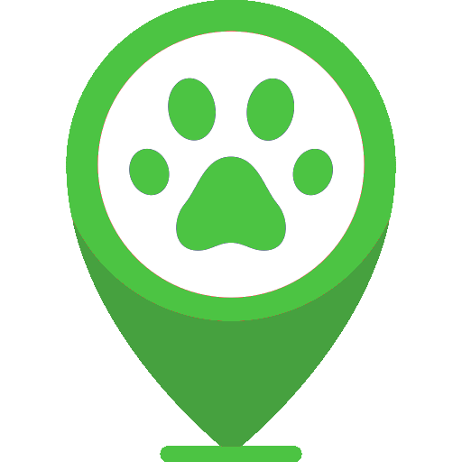

  

# watchpets
### *<Ultimate Track for ultimate results/>*
MVP - Final project of the Holberton School Foundations program.

WatchPets is a mobile application for daily use designed for people who have pets, the application allows you to send a quick alert to your friends close to your location point in case you suffer a loss of a pet, this alert will contain a detailed description of the pet lost and the point where you lost it, so that they can also help you with the search.

## Description
Before starting to detail what the views of the application contain, I want to point out that you will have a navigation menu on the left that you can access by pressing the "≡" icon, this will display the views that you have available.

The main view of the application (home), allows you to see the history of the alerts sent by the users of the application, these will be ordered from the most current alert to the oldest, each alert will contain the detail of the lost pet at the time , the location where the alert was sent, the approximate time it was lost and additionally a small message that will be optional to write.
In this same view you can find a small button at the bottom right so that you can send an alert to your close contacts in case you lose a pet, for this in the first part you will have to select the pet that you lost from the list of pets that you have added in the application, in the second part you can get your current location in google maps, in the third part you can select the approximate time when the pet was lost, in this same part you can add a short message that will accompany the alert, in the fourth part you will get by default a summary of the information that you are about to send which will have a button that will allow you to send the alert and finish the process.

The view of the profile of pets, allows you to see the pets that you have added to the application, each added pet will contain a small photo of the pet, its details, such as its name, age, hair color, etc.
In this same view you will have a button in the lower right part, which will allow you to add more pets to the application if you wish, and for this you will have to fill in all the data requested by the process.

The view of the user's profile, will allow you to see details of the username with which you logged into the application, such as your name, surname, login email and other data.

## Features
* Easy access to the registry of alerts sent by users of the application.
* The practical thing is to be able to send a personalized alert to your contacts with the detailed information of the lost pet.
* Quick access to detailed information about your pets, which you can use to send the alert much faster.
* You can easily log into the application with your Facebook account, and forget about creating a new record.

## contributions to the app for members

Click [here](https://pgomezboza.github.io/) to go the landing page.

Click [here](https://www.linkedin.com/posts/alexis-coran_hello-everyone-i-am-sharing-my-watchpets-activity-6864341761909686273-mtlp) to go blog of the proyect.

## Members

- Alexis Coronado [Github](https://github.com/AlexisCORAN), [Linkedin](https://www.linkedin.com/in/alexis-coran/)
- Manuel Condori [Github](https://github.com/Manuel-condori), [Linkedin](https://www.linkedin.com/in/mcondori28/)
- Piero Gomez [Github](https://github.com/pgomezboza), [Github](https://www.linkedin.com/in/pierogomez/)